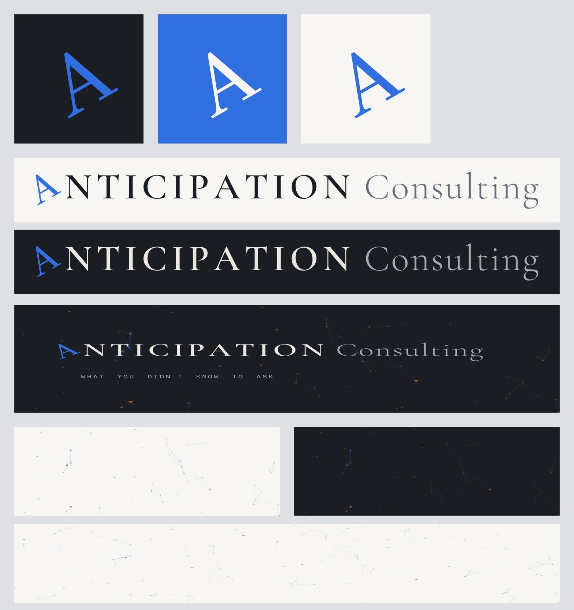

# Anticipation Consulting — brand assets

Identity assets for social profiles and outward-facing use, built from the two
brand typefaces. Everything in `dist/` is generated by `generate_assets.py`, so
the kit is reproducible and stays consistent with the website.



## The marks

| File | What it is | Use for |
| --- | --- | --- |
| `dist/avatar-ink-1000.png` | Brand-blue **A** on near-black | **Primary avatar** — GitHub, Bluesky, LinkedIn, X |
| `dist/avatar-ink-400.png` | Same, 400×400 | Smaller avatar slots |
| `dist/avatar-blue-1000.png` | Light **A** on brand blue | Alternate avatar |
| `dist/avatar-paper-1000.png` | Brand-blue **A** on warm white | Light-background avatar |
| `dist/wordmark-light.png` | Full lockup, dark text (transparent) | Letterhead on light grounds |
| `dist/wordmark-dark.png` | Full lockup, light text (transparent) | Letterhead on dark grounds |
| `dist/banner-1500x500.png` | Wordmark + tagline on the network field | **Bluesky / X header** |
| `dist/banner-linkedin-1584x396.png` | Wordmark banner, LinkedIn ratio | **LinkedIn cover** |
| `dist/mark-A.svg` | The **A** mark as vector outlines (transparent) | Print, scaling, design tools |
| `dist/mark-A-on-ink.svg` · `mark-A-on-blue.svg` | Vector mark on a ground | Favicons, app icons |

The **A** is GFS Didot, rotated −30° (matching the site logo and favicon); the
wordmark sets **NTICIPATION** in Cormorant Garamond SemiBold (tracked, uppercase)
and **Consulting** in Cormorant Garamond Light. The vector `mark-A*.svg` files
have the glyph converted to paths, so they render anywhere without the font.

## Network background

Banner-sized stills of the live interactive background (`#net-bg` in
`assets/site.js`) — triangle nodes in the logo triad joined by gradient links
that fade with distance. The generator ports the canvas algorithm exactly
(node density, link radius, opacities, triangle geometry), seeded so the layout
is reproducible. Each size ships on two grounds: warm **paper** (what visitors
see on the site) and **ink** (for dark social headers and slides).

| File | Size | Use for |
| --- | --- | --- |
| `dist/network-bg-1500x500.png` · `…-ink.png` | 1500×500 | Bluesky / X header (no wordmark) |
| `dist/network-bg-linkedin-1584x396.png` · `…-ink.png` | 1584×396 | LinkedIn cover |
| `dist/network-bg-1280x640.png` · `…-ink.png` | 1280×640 | GitHub social preview, OG image, slide cover |
| `dist/network-bg-1920x1080.png` · `…-ink.png` | 1920×1080 | Slide / video / virtual-call background |

## Palette

| Token | Hex | Use |
| --- | --- | --- |
| Brand blue | `#2f6fe0` | The mark; accents; network node |
| Copper | `#b5783f` | Network node (logo triad) |
| Green | `#2f7d54` | Network node (logo triad) |
| Ink | `#1a1d22` | Dark grounds, primary text |
| Paper | `#f7f6f2` | Light grounds |
| Ink-soft | `#636b77` | "Consulting", secondary text on light |
| On-ink-soft | `#a5acb8` | "Consulting", secondary text on dark |

## Typefaces

- **GFS Didot** — the "A" mark. SIL Open Font License.
- **Cormorant Garamond** — the wordmark. SIL Open Font License.
- **IBM Plex Mono** — the tagline lockup. SIL Open Font License.

Fonts are not vendored in the repo; `fetch_fonts.sh` pulls them from Google
Fonts. Generated raster/vector output is unrestricted.

## Clearspace & usage

- Keep clearspace around the mark of at least the height of the **A**.
- Don't recolor the mark outside the palette, rotate it further, or stretch it.
- On busy photography, use `avatar-ink-*` or place the mark on a solid ground.

## Regenerating

```bash
cd brand
./fetch_fonts.sh                       # once, fetches OFL fonts into fonts/
pip install Pillow fonttools           # cairosvg optional, only to validate SVGs
python3 generate_assets.py             # writes everything into dist/
```

Edit the palette/spacing constants at the top of `generate_assets.py` to adjust.
